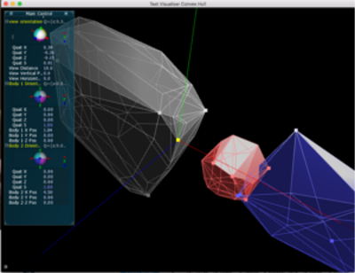
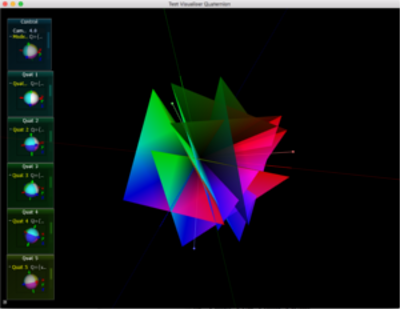

# Makena : Physics Engine and Geometric Tools

# Highlights

* Velocity-space constraint-based engine with an iterative MLCP.
* Experimental feature-based contact tracking to avoid rediscovering at 
every simulation step.
* Some useful and stable geometric tools such as GJK collision detector, 
convex hull finder, and intersection finder.
* Convex rigid body simulation.
* Joints: Slider, Piston, Hinge, Universal, Ball, and Fixed with limits and 
frictions/motors.
* Written in standard C++14.
* The collision detector still in development and buggy.

# Overview

Makena is a velocity-space, constraint-based physics engine for convex rigid 
body simulation.
It also contains some useful stand-alone geometric tools such as convex hull finders and an intersection finder for convex polytopes.
The development is still in progress (pre-alpha release).  
The development originally started to experiment an idea to track contacts over multiple simulation steps.
Conventional physics engines run multiple iteration of geometric configuration update and collision detection
until there are no new collisions found.
This is an attempt to track the resting or sliding contacts that have been already discovered
in the previous steps to avoid such iterations at the next simulation steps onwards.
The target objects are convex rigid bodies. (Non-convex objects can be handled by gluing convex objects with fixed joints.)
It supports the joints with both angular and linear limits, frictions/motors, and velocity limits.
The supported joints are : ball, hinge 1, universal, slider, piston, and fixed joints.
The contraints are solveed by a projected Gauss-Seidel iterative MLSP solver.
The contact frictions are not integrated in the complementarity conditions. They are handled at the next step
by boxed-bilateral constraints based on the pressue along the contact normal direction found at the previous step.
The new contact detector still has errors that cause excessive repulsive forces & torques.
The current implementation is written in the standard C++14 with no external dependencies and no optimization has been performed yet.

# Samples

## Physics Simulation

Following are some test visualizations of Makena physics engine that demostrate the ability to handle joints, collisions, 
and resting/sliding contacts with frictions.

TEXT TEXT TEXT. TEXT TEXT TEXT.TEXT TEXT TEXT. TEXT TEXT TEXT.
TEXT TEXT TEXT. TEXT TEXT TEXT.TEXT TEXT TEXT. TEXT TEXT TEXT.

TEXT TEXT TEXT. TEXT TEXT TEXT.TEXT TEXT TEXT. TEXT TEXT TEXT.
TEXT TEXT TEXT. TEXT TEXT TEXT.TEXT TEXT TEXT. TEXT TEXT TEXT.

TEXT TEXT TEXT. TEXT TEXT TEXT.TEXT TEXT TEXT. TEXT TEXT TEXT.
TEXT TEXT TEXT. TEXT TEXT TEXT.TEXT TEXT TEXT. TEXT TEXT TEXT.

And here are some visualizations of some stand-alone components developed for Makena

## GJK intersection finder (collision detector)

## Intersection finder for two convex polytopes

## 3D Convex hull finder

## Intersection finder for two convex polygons

## Quaternion Average finder

# Install

# Contact Tracking

# Unit Tests

# Requirements

# License

# Contact

The contact discovery flow
1. AABB culling
2. OBB separating axis test
3. GJK
4. Finding intersection
5. Finding feature pair
6. Contact point pairs generation 
7. Unilateral constraints generation

Contace update flow
1. Contact features update
2. Contact point pairs generation
3. Unilateral constraints generation

Contact removal
A tracked contact will be removed under one of the following conditions.
1. Contact udpater did not find appropriate contact.
2. All the constraints were inactive in the latest solution by the constraint solver (MLCP).

NOTE: Collision Detector yet unstable.

Samples

Motivation

Features

Mile Stones and Status

July 8, 2018: Pre-alpha release

Issues and Future Plan

XXXX: Alpha release

- Stability 
- Optimization for target device

File Inventory

- Low level 

primitives.{hpp,cpp}
Implements Vectors of 2D and 3D, and 3x3 matrixand their basic
operations. It also provides a 3x3symmetric Eigenvalue finder and
a principal component analyzer assuming the 3x3 matrixrepresents covariance.

quaternion.{hpp,cpp}
Implemens data structures and basic operations for Quaternion.
it also finds the weighted averages of quaternions by a variant of
QUEST algorithm.

variable_primitives.hpp
Implements a vector and a symmetrix square matrix of variable lengths.
This is used by the iterative MLCP solver.

manifold.{hpp,cpp}
manifold_convex_hull.cpp
It represents a 3D compact closed piece-wise linear convex manifold.
It consists of vertices, edges (half-edges), and faces (convex polygon) that 
are connected as a planar graph with an embedding.
It provides a set of operations to explore the graph, and to find the normals. 
It also has a built-in convex hull finder from a set of points.

convex_rigid_body.hpp
It represents aconvex ridig body for physics simulation.              
It has the shape in LCSrepresented by Manifold, a geometric configuration 
(position, orientation,linear velocity, and angular  velocity), forces, 
torques, mass, inertia matrix, and friction coefficients.
It alsohas AABB and OBB internally up-to-date,depending on the current 
position and orientation in GCS.           

jacobian_constraint.hpp
It represents aJacobian constraint in the velocity space for
constraint-based simulation. It is one of bilateral free, bilateral
boxed, and unilateral constraint.

binary_dilation.hpp                                                    
Represents a vertex of the binary dilation polygon (a.k.a Minkowski sum A-B).

contact_pair_info.hpp
Represents a contact between two convex rigid bodies. It is used to track
contacts over multiple iterations.
Makena tries to keep track of a contact by a feature pair. A feature is
one of vertex, edge, or face.
It also holds the current set of contact point pairs in LCS for each body,
and the contact direction, which will be used to generate a set of unilateral
constraints for the current time step, and to generate a set of boxed bilateral
constraints for the next step if the current feature pair is still in effect.

intersection_finder.{hpp,cpp}
Finds the intersection of two convex polytopes in 3D.
The resuls is one of null, a point, an edge (line segment), a convex polygon, or a convex polytope.

convex_hull_2d.{hpp,cpp}
Finds the convex hull of two convex polygons.

intersection_convex_polygon_2d.{hpp,cpp}
Finds the intersection of two convex polygons in 2D by 4 iteration of sweeping.

aabb.hpp
Represents an axis-alignedbounding box. 

broad_phase_aabb_collision_detector.hpp
Provides broad-phase collision culling using AABBs.
It uses enter-leave sweeping paradigm on X, Y, and Z axes.
For each axis, the order or the objects is updated using bubble sort.

orienting_bounding_box.hpp
Finds the optimum orienting bounding box of convex polytope.

obb_obb_test.{hpp,cpp}
Performs separation axis test on a pair of OBBs. 

binary_dilation.hpp
Represents a binary dilation (also known as Minkowski sum) of A - B.
Used by GJK collision detection algorithm.

gjk_origin_finder.{hpp,cpp}
GJK collision detector on a pair of convex polytopes.

mlcp.{hpp,cpp}
Solves Mixed Linear Complementarity Problem or MLCP for a symmetric PD matrix
with an iterative projected Gauss-Seidel solver (basically SOR with clamping)
with subspace minimization with Cholesky factorization when applicable.

joint_manager.hpp
Manages the joints, and generates a set of Jacobian constraints at each 
simulation step.                                                       
  - Piston joint (DoF 2)
  - Slider joint (DoF 1)
  - Fixed  joint (DoF 0)
  - Hinge 2/Universal joint (DoF 2)
  - Hinge 1 joint (DoF 1)
  - Ball joint (DoF 3)
The linkages are implemented by bilateral free constraints.
The joint limits are implemented by unilateral constraints.
The joint frictions/motors are implemented by bilateral boxed constraints.
The joint velocity limiters are implemented by unilateral constraints.

constraint_manager.{hpp,cpp}
Core of the engine. It takes the constraints, and calculates the lambdas
(lagrange multipliers) by MLCP, which are used to calculate the induced 
internal forces and torques at each simulation step. Then it updates the
geometric configuration of each convex rigid body.

- Contact Discovery and Tracking (Experimental)

contact_manager.{hpp,cpp}
It keeps track of the contacts of convex rigid bodies.
It discovers a new collision pair between two bodies by a series of 
collision detection algorithms and then generate constraints to avoid 
penetration.
It keeps track of the contact by a pair of features.
For the second step onwards it udpates the current feature pair if necessary
and generates contact constraints to avoid generation. Also it generates 
constraints to implement static and dynamic friction.

contact_discoverer.{hpp,cpp}
Assuming the given two convex rigid bodies are in contact, it finds
the appropriate feature pairs to avoid penetration.

contact_updater.{hpp,cpp}
contact_updater_edge_edge.{hpp,cpp}
contact_updater_edge_vertex.{hpp,cpp}
contact_updater_face_edge.{hpp,cpp}
contact_updater_face_face.{hpp,cpp}
contact_updater_face_vertex.{hpp,cpp}
contact_updater_vertex_vertex.{hpp,cpp}
contact_updater_further_checker.{hpp,cpp}
Tries to update the current contact pair. It tries to update the active 
feature pair based on the current positions and orientations of two convex
rigid bodies.

contact_points_and_normal_generator.{hpp,cpp}
Generates a set of point pairs in LCS from the active feature pair and finds
a contact direction. They are used to generate unilateral constraints.

intersection_decomposer.{hpp,cpp}
Decomposes the surface of the intersection of two convex polytopes
into three categories: boundary, polytope 1, and polytope 2     

- Others

- voronoi_3simplex_graph.hpp
  Data structure and algorithm to perform 
  a point to 3-simplex classification test into one of Voronoi region

bd_boundary_simplex_finder.hpp
  This finds a 2-, 1-, or 0-simplex on the boundary of the given 
  binary dilation (Minkowski sum A-B) in the specific direction from the origin

- red_black_tree.hpp
  A red-black tree implementation.

- loggable.hpp
  Virtual base classe that implements basic logging functionality

