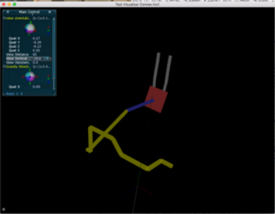
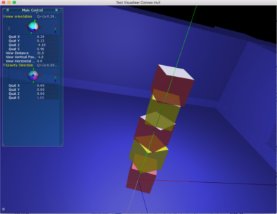
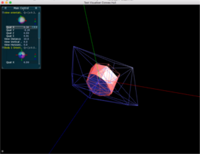
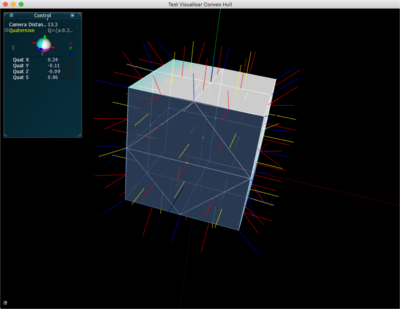
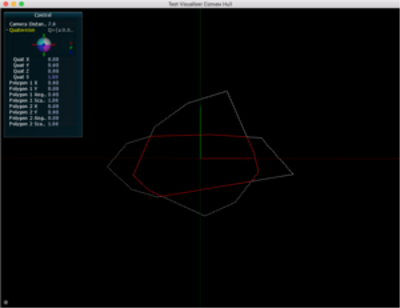
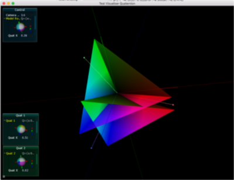
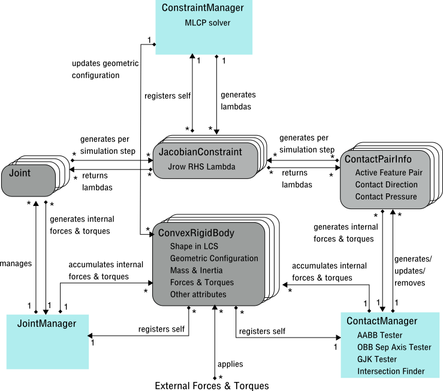
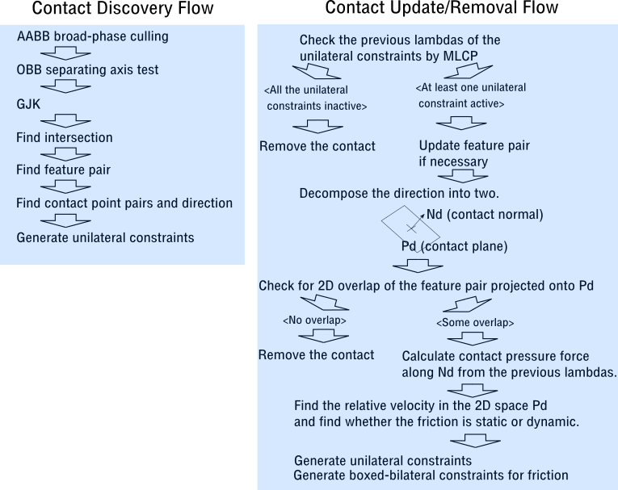

# Makena : Physics Engine and Geometric Tools


# Highlights

* Velocity-space constraint-based engine with an iterative MLCP.
* Experimental feature-based contact tracking to avoid rediscovering at every 
simulation step.
* Some useful and stable geometric tools such as GJK collision detector, convex
 hull finder, and intersection finder.
* Convex rigid body simulation.
* Joints: Slider, Piston, Hinge, Universal, Ball, and Fixed with limits and 
frictions/motors.
* Written in standard C++14.
* The collision detector still in development and buggy.


# Overview

Makena is a velocity-space, constraint-based physics engine for convex rigid 
body simulation.
It also contains some useful stand-alone geometric tools such as convex hull 
finders and an intersection finder for convex polytopes.
The engine development around collision discovery is still in progress
(pre-alpha release).  

The development originally started to experiment an idea to track contacts over
 multiple simulation steps.
Conventional physics engines run multiple iterations of geometric configuration
update and collision detection until there are no new collisions found in a 
single simulation step.
Makena is an attempt to track the resting or sliding contacts that have been 
already discovered in the previous steps to avoid such iterations at the cost
of more expensive processing at the discovery that involves finding the 
intersection of two penetrating polytopes.
The author hopes this more involved discovery process and the tracking will 
contribute to more stabilized and consistent unilateral constraints generation.

The target objects are convex rigid bodies. Non-convex objects can be realized
by gluing convex objects with fixed joints.
It supports the joints with both angular and linear limits, frictions/motors, 
and velocity limits. The supported joints are : ball, hinge 1, universal, 
slider, piston, and fixed joints.
The contraints are solved by a projected Gauss-Seidel iterative MLCP solver.
The contact frictions are not integrated in the complementarity conditions, as
the author cannot find a way to realize them without violating the PSD condition
on the matrix M.
They are handled at the next step by boxed-bilateral constraints based on the 
pressue along the contact normal direction found at the previous step.

The new contact detector still has errors that cause generation of erraneous 
contact feature pairs, that manifests as excessive repulsive forces & torques
in the simulation. Other than that, it has no other fatal issues found through
the unit tests and interactive tests.
The current implementation is written in the standard C++14 with no external
dependencies and no optimization has been performed yet.


# Sample Videos

## Physics Simulation
__Click the images below for movies__.

Following are some test visualizations of Makena physics engine that demostrate
joints, collisions, and resting/sliding contacts with frictions.

[](https://youtu.be/X6oTUmtE51Q)

This is a recording from `bins_interactive_tests/test_visualizer_demo01`.

This demonstrates the following.
* Ball joints for the hangind board
* Slider joint for the blue bar poking the board.
* Hinge joints at the cranks and rods.
* Fixed joints to form L-shaped cranks.
* Universal joints to implement the offset in the two horizontal axes.

The number of constraints for MLCP solver is around 90.
Some torque is applied to the middle shaft when it is highlighted in red.
Interesting to see the numerical drift due to accummulated numerical errors
including the effect of CFM manifests itself as the flexing handle on the right hand 
side.

[](https://youtu.be/Kwkn6ANskhY)

This is a recording from `bins_interactive_tests/test_visualizer_contacts`.

The snapshot from the test rig.
The collision detector has some bugs that manifest as excessively repulsive 
forces in the video.
The colllision detector is not stable but it shows the validity of contact 
tracking of Makena engine, especially how it handles stacking of objects with
frictions.
The white ray from the origin indicates the direction of gravity.
It involves unilateral constraints for contacts and boxed bilateral constraints
for frictions.

[](https://youtu.be/5dg-LZOpmAw)

A snapshot from a test rig for an earlier version of the engine.
15 random convex objects falling to the ground according to the gravity and 
friction.

And here are some visualizations of some stand-alone components developed for 
Makena. They are pretty stable.

## GJK intersection finder (collision detector)
[](https://youtu.be/GfJqVzhR0S8)

This is a recording from `bins_interactive_tests/test_visualizer_gjk_origin_finder demo_patterns/pattern_convex_hull_1000.txt demo_patterns/pattern_convex_hull_mid_size.txt`.

This is a visualization of GJK collision detection algorithm that utilizes 
binary dilation (aka Minkowski sum).
The red and blue polytopes represent the pair of convex objects to be tested.
They are placed and oriented in GCS as visualized here.
The grey polytope represents the binary dilation.
The small solid cubes at the vertices of the grey polytope represent the 
simplex that encloses or is the closest to the origin.
The small solid red and blue cubes at the vertices of input polytopes 
correspond to the simplex in the binary dilation.
If the two objects intersect, the origin is highlighted in yellow.
If not, then the yellow ray from the origin indicate the direction from the 
closest point on the simplex to the orign.

## Intersection finder for two convex polytopes
[](https://youtu.be/FT_R4QHUpDQ)

This is a recording from `bins_interactive_tests/test_visualizer_intersection_finder demo_patterns/pattern_convex_hull_1000.txt demo_patterns/pattern_convex_hull_mid_size.txt`.

This is a visualization of intersection of 2 convex polytopes.
The red and blue wireframes represent the input polytope 1 and 2 respectively.
The solid red represents the boundary of the intersection that coincides with 
boundary of polytope 1, and that are interior of polytope 2. 
The solid blue is the boundary of polytope 2 and interior of polytope 1. 


## 3D Convex hull finder
[](https://youtu.be/7nrXpwJMh0Q)

This is a recording from `bins_interactive_tests/test_visualizer_manifold_convex_hull demo_patterns/pattern_convex_hull_mid_size.txt`.

This is a visualization of the convex hull algorithm.
First, a 3-simplex is formed from 4 points that are found by PCA.
It aims at enclosing as many points as possible in the beginning.
After that, each of the remaining points is tested using a data structure called 
conflict graph.
A red point indicates the current point, the red edge indicates the frontier 
for the current point.
The interior faces of the frontier will be removed, and new triangular fan 
seals the hollow part inside the frontier with the current point at its center.
The blue, red, and yellow rays indicate the outward vertex, edge, and face 
normals respectively.

[](https://youtu.be/lCTMRB5TIuA)

This is a recording from `bins_interactive_tests/test_visualizer_manifold_convex_hull demo_patterns/pattern_convex_hull_1000.txt`.

This is another point-by-point visualization of finding the convex hull of
1,000 points. 

[](https://youtu.be/Jrqs7vpF9Bw)

This is a recording from `bins_interactive_tests/test_visualizer_manifold_convex_hull demo_patterns/pattern_convex_hull_pathetic_cube.txt`.

Visualization of convex hull algorithm for the points whose convex hull is 
(almost) a cube but have some almost coincident vertices and almost co-linear
edges. 

## Intersection finder for two convex polygons
[](https://youtu.be/_J9Uosw3RfM)

This is a recording from `bins_interactive_tests/test_visualizer_intersection_convex_polygon_2d demo_patterns/pattern_convex_hull_mid_size.txt demo_patterns/pattern_convex_hull_1000.txt`.

Visualization of intersection of 2 convex polygons.
The two white polygons represent the input, and the red one is the boundary of
the intersection.
The algorithm is my original that takes up to 4 vertical sweeps.
It runs in linear time.

## Quaternion Average finder

[](https://youtu.be/qxkgNs0ltao)

This is a recording from `bins_interactive_tests/test_visualizer_quaternion 5`.

Visualization of average of 5 quaternions by QUEST algorithm.

[](https://youtu.be/6UZVWl_xGCg)

This is a recording from `bins_interactive_tests/test_visualizer_quaternion 2`.

Visualization of weighted average of 2 Quaternions by QUEST algorithm.
This is essentially equivalent to the interpolation of two Quaternions (SLERP).


# Dependencies
Makena is written in C++14, and should work for any conformant tool chain.
It is tested on macOS 10.13.5 with Apple LLVM version 9.1.0 (clang-902.0.39.2).

Makena depends on 
[Wailea graph library](https://github.com/ShoYamanishi/wailea).

# Install

## Main library.
`$ make` or `$ make all`.

This will get you `libs/libmakena.so`.
Please note that Makena is still in pre-alpha stage, and there is yet a 
proper installation procedure.

## Unit Tests
`$ make unit_tests`.

This will run the unit tests.
Please note it depends on [GoogleTest](https://github.com/google/googletest)
unit test framework.
Please change the following in Makefile for your environment.

```# Change the following two locations to yours.
GOOGLE_TEST_INC_DIR   = -I./GoogleTest/include
GOOGLE_TEST_LIB_DIR   = -L./GoogleTest/lib
```


## Interactive Tests (Demos)
`$ make interactive_tests`.

This will get you some standalone OpenGL programs under 
`bins_interactive_tests`.

Please note it depends on the following:

* [GLM](https://glm.g-truc.net/0.9.9/index.html)
* [GLEW](http://glew.sourceforge.net/basic.html)
* [GLFW3](http://www.glfw.org)
* [AntTweakBar](http://anttweakbar.sourceforge.net/doc/)

Please note that GLFW and AntTweakBar may have to be hacked for Macbook's
Retina display for which the pixel size and the screen coordinate unit 
are different. How to do is to be added to Wiki later.


# License
Copyright (c) 2018 Shoichiro Yamanishi

Makena is released under MIT license. See `LICENSE` for details.


# Contact
For any inquiries, please contact:
Shoichiro Yamanishi

yamanishi72@gmail.com


# Milestones and Status

* November, 2017: Concept and experiments start
* January, 2017: Component development start
* March, 2018: Design convergeance
* June 30,2018: Unit test complete (old version)
* July 1, 2018: Contact tracker revised (not unit tested)
* July 8, 2018: Pre-alpha release 
It is not complete, but the author has to start working on other projects
as of July 1, 2018.


# Issues and Future Plan

* __M1__: Development of debugging framework

This involves development of simulation recorder, player, and visualizer.
(Estm. 50 Engineer-day.)

* __M2__: Integration Test Complete

* __A3__: Alpha release

* __M4__: Bug Convergeance

* __M5__: Load/stability test complete

* __B6__: Beta release

* __F1__: Adding Sphere object

* __F2__: Adding 2.5 fixed terrain

* __F3__: Adding cloth, rope simulation

* __F4__: Optimization for mobile devices


# Makena Engine Design
This section describes the brief overview of Makena engine design and the key 
concept, the contact tracking.

## Design Overview
Following is a object diagram of Makena.



There are three main engine comoponents: ContraintManager, JointManager,
and ContactManager.
__ConstraintManager__ takes the unilateral and bilateral constraints for the 
joints and contacts, runs the MLCP solver, and then generates solutions as 
lagrangian multipliers (lambdas).

__JointManager__ manages all the joints, generates 
the Jacobian constraints for the current simulation step using the current
geometry configuration, receives the lamdas, and then generates internal
forces and torques for the participating convex rigid bodies.

__ContactManager__ is the core of Makena engine. It performs series of 
collision tests and discover new collison between two convex rigid bodies.
The new collision is kept as a pair of two features on the convex rigid bodies.
Here a feature is one of vertex, edge, or face.
It keeps track of all the collisions over multiple simulation step, and removes
them if they are safe to be done so.

There are 4 objects that work as container of data.

__ConvexRigidBody__ represents a target object for simulation. It has the shape
in a convex manifold as a network of vertices, edges, and faces with normals
in LCS, the geometric configuration (position of CoM, orientation, linear and
angular velocity) for the current time step, Mass, inertia matrix, friction
coefficients, and other attributes.

__Joint__ represents one joint type with angular & linear limits, friction and
velocity limites where applicable. One joint is usually realized by a set of
bilateral and unilateral constraints A joint refers to a pair of 
ConvexRigidBodies. It has an anchor point and some referent axes in LCS in each
 of those bodies.

__ContactPairInfo__ represent the collision between two ConvexRigidBodies
discovered and updated by ContactManager. Due to the convexity of the bodies,
the contact is a closed connected region, and it is essentially a pair of
features.
It also has the direction of contact, which is used to generate the unilateral
constraints, and the contact pressure force calculated from the previous step,
which is used to generate friction bilateral boxed constraints.

__JacobianConstraint__ represents a single constraint for the complementarity
problem formulation. It is one of unilateral, bilateral-free, and 
bilateral-boxed types. It consists of 6 elements on the LHS as coffeicients
to velocity space, and 1 element on RHS which is in the unit of velocity.
The MLCP solver in ConstraintManager returns a solution that meets the 
constraint.


## Key Concept: Active Feature Pair
As mentioned above, Makena keeps track of a contact between two objects as
a pair of features. The rationale behind this is two fold:

1. The contact (intersection) between two convex objects are closed, compact,
and it can be essentially represented by a pair of features.

2. Such a pair of features has temporal cohesion over multiple iterations.
I.e., the pair of features does not change often if the objects are resting, or
sliding. 

The pair of features can be one of the following 7 types.


In reality d1, e, and f rarely occur.


## Key Concept: Contact Tracking

Makena tries to eliminate the cycle of configuration update and collision
detection until convergence within a single simulation step by keeping track
of existing contacts in the pairs of features pairs, and thus eliminate
the need for rediscovery at each new simulation step.
Following describes the flow of the new contact discovery and existing
contact update/removal.




At the contact discovery it lets two objects penetrate at the preliminary
configuration update.
It goes through the usual collision detection flow until GJK.
After the GJK, the actual intersection (penetration volume) is found and 
then the active feature pair is guessed from the following.

* Most likely separation axis (axes).
This is found by gradually shrinking the OBBs until it finds a separation axis.
* Shape and the location of the boundaries of the convex rigid bodies on the
penetration volume. If there is a dominant boundary face of a convex ridig
body on the penetratino volume, we pick it.
* Distribution of the relative velocity in the penetration volume. If the
relative velocity is uniform among the volume, we pick it as the direction of
collision.

It finds the active feature pair and the direction as above, and then the 
contact point pairs are found as the 2D intersection of two features projected
onto the plane perpendicular to the collision direction.

At the contact update, we first try to demote or promote the feature pair.
For example if the previous pair is face-face, and if we find the two face
normals are no longer aligned, we demote it to face-edge or face-vertex
accordingly.
Then we decompose the direction into two: the contact normal
direction `Nd` and the plane `Pd` perpendicular to it. Since the two objects
are resting or sliding, there should be no movement along `Nd`. We project
the features onto `Pd` and check for intersection. If there is no intersection
we remove the contact. Otherwise, we generate the contact point pairs in the
same way as the contact discovery, which will be used to generate unilateral
constraints.


# Annotated File List


## Data Containers and Operators


* __primitives__

[primitives.hpp](include/primitives.hpp)

[primitives.cpp](src_lib/primitives.cpp)

Implements Vectors of 2D and 3D, and 3x3 matrixand their basic
operations. It also provides a 3x3symmetric Eigenvalue finder and
a principal component analyzer assuming the 3x3 matrixrepresents covariance.


* __quaternion__

[quaternion.hpp](include/quaternion.hpp)

[quaternion.cpp](src_lib/quaternion.cpp)

Implemens data structures and basic operations for Quaternion.
it also finds the weighted averages of quaternions by a variant of
QUEST algorithm.


* __variable_primitives__

[variable_primitives.hpp](include/primitives.hpp)

Implements a vector and a symmetrix square matrix of variable lengths.
This is used by the iterative MLCP solver.


* __manifold__

[manifold.hpp](include/manifold.hpp)

[manifold.cpp](src_lib/manifold.cpp)

[manifold_convex_hull.cpp](src_lib/manifold_convex_hull.cpp)

It represents a 3D compact closed piece-wise linear convex manifold.
It consists of vertices, edges (half-edges), and faces (convex polygon) that 
are connected as a planar graph with an embedding.
It provides a set of operations to explore the graph, and to find the normals. 
It also has a built-in convex hull finder from a set of points.


* __convex_rigid_body__

[convex_rigid_body.hpp](include/convex_rigid_body.hpp)

It represents aconvex ridig body for physics simulation.              
It has the shape in LCSrepresented by Manifold, a geometric configuration 
(position, orientation,linear velocity, and angular  velocity), forces, 
torques, mass, inertia matrix, and friction coefficients.
It alsohas AABB and OBB internally up-to-date,depending on the current 
position and orientation in GCS.           


* __jacobian_constraint__

[jacobian_constraint.hpp](include/jacobian_constraint.hpp)

It represents aJacobian constraint in the velocity space for
constraint-based simulation. It is one of bilateral free, bilateral
boxed, and unilateral constraint.

* __binary_dilation__

[binary_dilation.hpp](include/binary_dilation.hpp)

Represents a vertex of the binary dilation polygon (a.k.a Minkowski sum A-B).


* __contact_pair_info__

[contact_pair_info.hpp](include/contact_pair_info.hpp)

Represents a contact between two convex rigid bodies. It is used to track
contacts over multiple iterations.
Makena tries to keep track of a contact by a feature pair. A feature is
one of vertex, edge, or face.
It also holds the current set of contact point pairs in LCS for each body,
and the contact direction, which will be used to generate a set of unilateral
constraints for the current time step, and to generate a set of boxed bilateral
constraints for the next step if the current feature pair is still in effect.


* __aabb__

[aabb.hpp](include/aabb.hpp)

Represents an axis-alignedbounding box. 


* __orienting_bounding_box__

[orienting_bounding_box.hpp](include/orienting_bounding_box.hpp)

Finds the optimum orienting bounding box of convex polytope.


* __binary_dilation__

[binary_dilation.hpp](include/binary_dilation.hpp)

Represents a binary dilation (also known as Minkowski sum) of A - B.
Used by GJK collision detection algorithm.


## Algorithms


* __intersection_finder__

[intersection_finder.hpp](include/intersection_finder.hpp)

[intersection_finder.cpp](src_lib/intersection_finder.cpp)

Finds the intersection of two convex polytopes in 3D.
The resuls is one of null, a point, an edge (line segment), a convex polygon, or a convex polytope.


* __convex_hull_2d__

[convex_hull_2d.hpp](include/convex_hull_2d.hpp)

[convex_hull_2d.cpp](src_lib/convex_hull_2d.cpp)

Finds the convex hull of two convex polygons.


* __intersection_convex_polygon_2d__

[intersection_convex_polygon_2d.hpp](include/intersection_convex_polygon_2d.hpp)

[intersection_convex_polygon_2d.cpp](src_lib/intersection_convex_polygon_2d.cpp)

Finds the intersection of two convex polygons in 2D by 4 iteration of sweeping.


* __broad_phase_aabb_collision_detector__

[broad_phase_aabb_collision_detector.hpp](include/broad_phase_aabb_collision_detector.hpp)

[broad_phase_aabb_collision_detector.cpp](src_lib/broad_phase_aabb_collision_detector.cpp)

Provides broad-phase collision culling using AABBs.
It uses enter-leave sweeping paradigm on X, Y, and Z axes.
For each axis, the order or the objects is updated using bubble sort.

* __obb_obb_test__

[obb_obb_test.hpp](include/obb_obb_test.hpp)

[obb_obb_test.cpp](src_lib/obb_obb_test.cpp)

Performs separation axis test on a pair of OBBs. 


* __gjk_origin_finder__

[gjk_origin_finder.hpp](include/gjk_origin_finder.hpp)

[gjk_origin_finder.cpp](src_lib/gjk_origin_finder.cpp)

GJK collision detector on a pair of convex polytopes.


* __mlcp__

[mlcp.hpp](include/mlcp.hpp)

[mlcp.cpp](src_lib/mlcp.cpp)

Solves Mixed Linear Complementarity Problem or MLCP for a symmetric PD matrix
with an iterative projected Gauss-Seidel solver (basically SOR with clamping)
with subspace minimization with Cholesky factorization when applicable.


* __joint_manager__

[joint_manager.hpp](include/joint_manager.hpp)

[joint_manager.cpp](src_lib/joint_manager.cpp)

Manages the joints, and generates a set of Jacobian constraints at each 
simulation step.                                                       
- Piston joint (DoF 2)
- Slider joint (DoF 1)
- Fixed  joint (DoF 0)
- Hinge 2/Universal joint (DoF 2)
- Hinge 1 joint (DoF 1)
- Ball joint (DoF 3)
The linkages are implemented by bilateral free constraints.
The joint limits are implemented by unilateral constraints.
The joint frictions/motors are implemented by bilateral boxed constraints.
The joint velocity limiters are implemented by unilateral constraints.


* __constraint_manager__

[constraint_manager.hpp](include/constraint_manager.hpp)

[constraint_manager.cpp](src_lib/constraint_manager.cpp)

Core of the engine. It takes the constraints, and calculates the lambdas
(lagrange multipliers) by MLCP, which are used to calculate the induced 
internal forces and torques at each simulation step. Then it updates the
geometric configuration of each convex rigid body.


## Contact Discovery and Tracking Specific


* __contact_manager__

[contact_manager.hpp](include/contact_manager.hpp)

[contact_manager.cpp](src_lib/contact_manager.cpp)

It keeps track of the contacts of convex rigid bodies.
It discovers a new collision pair between two bodies by a series of 
collision detection algorithms and then generate constraints to avoid 
penetration.
It keeps track of the contact by a pair of features.
For the second step onwards it udpates the current feature pair if necessary
and generates contact constraints to avoid generation. Also it generates 
constraints to implement static and dynamic friction.


* __contact_discoverer__

[contact_discoverer.hpp](include/contact_discoverer.hpp)

[contact_discoverer.cpp](src_lib/contact_discoverer.cpp)

Assuming the given two convex rigid bodies are in contact, it finds
the appropriate feature pairs to avoid penetration.


* __contact_udpater__

[contact_updater.hpp](include/contact_updater.hpp)

[contact_updater.cpp](src_lib/contact_updater.cpp)

[contact_updater_edge_edge.hpp](include/contact_updater_edge_edge.hpp)

[contact_updater_edge_edge.cpp](src_lib/contact_updater_edge_edge.cpp)

[contact_updater_edge_vertex.hpp](include/contact_updater_edge_vertex.hpp)

[contact_updater_edge_vertex.cpp](src_lib/contact_updater_edge_vertex.cpp)

[contact_updater_face_edge.hpp](include/contact_updater_face_edge.hpp)

[contact_updater_face_edge.cpp](src_lib/contact_updater_face_edge.cpp)

[contact_updater_face_face.hpp](include/contact_updater_face_face.hpp)

[contact_updater_face_face.cpp](src_lib/contact_updater_face_face.cpp)

[contact_updater_face_vertex.hpp](include/contact_updater_face_vertex.hpp)

[contact_updater_face_vertex.cpp](src_lib/contact_updater_face_vertex.cpp)

[contact_updater_vertex_vertex.hpp](include/contact_updater_vertex_vertex.hpp)

[contact_updater_vertex_vertex.cpp](src_lib/contact_updater_vertex_vertex.cpp)

[contact_updater_further_checker.hpp](include/contact_updater_further_checker.hpp)

[contact_updater_further_checker.cpp](src_lib/contact_updater_further_checker.cpp)

Tries to update the current contact pair. It tries to update the active 
feature pair based on the current positions and orientations of two convex
rigid bodies.


* __contact_points_and_normal_generator__

[contact_points_and_normal_generator.hpp](include/contact_points_and_normal_generator.hpp)

[contact_points_and_normal_generator.cpp](src_lib/contact_points_and_normal_generator.cpp)

Generates a set of point pairs in LCS from the active feature pair and finds
a contact direction. They are used to generate unilateral constraints.


## Others


* __voronoi_3simplex_graph__

[voronoi_3simplex_graph.hpp](include/voronoi_3simplex_graph.hpp)


  Data structure and algorithm to perform 
  a point to 3-simplex classification test into one of Voronoi region
  Such a graph is needed to give consistent result.


* __bd_boundary_simplex_finder__

[bd_boundary_simplex_finder.hpp](include/bd_boundary_simplex_finder.hpp)

[bd_boundary_simplex_finder.cpp](src_lib/bd_boundary_simplex_finder.cpp)

This finds a 2-, 1-, or 0-simplex on the boundary of the given 
binary dilation (Minkowski sum A-B) in the specific direction from the origin


* __red_black_tree__

[red_black_tree.hpp](include/red_black_tree.hpp)

[red_black_tree.cpp](src_lib/red_black_tree.cpp)

A red-black tree implementation.


* __loggable__

[loggable.hpp](include/loggable.hpp)

[loggable.cpp](src_lib/loggable.cpp)

Virtual base classe that implements basic logging functionality


* __intersection_decomposer__

[intersection_decomposer.hpp](include/intersection_decomposer.hpp)

[intersection_decomposer.cpp](src_lib/intersection_decomposer.cpp)

Decomposes the surface of the intersection of two convex polytopes
into three categories: boundary, polytope 1, and polytope 2     


# References

To be added.

* [ESHD05] Physics-Based Animation by Erleben, Sporring, Henriksen, and Dohlmann

* [E04] Real-Time Collision Detection by Ericson

* [BCKO97] Computational Geometry : Algorithms and Applications by de Berg, Cheong, van Kreveld, and Overmars

* [HB86] Computer Graphics with OpenGL by Hearn and Baker

* [XX] MLCP papers